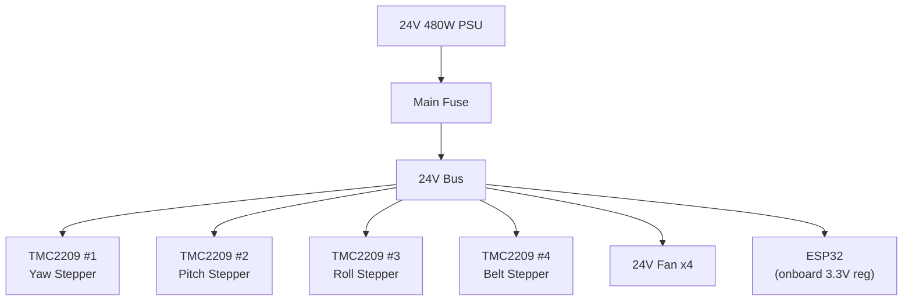

# Apparatus Electronics

The testing apparatus runs on a separate electrical system from the subscale satellite. An ESP32 controls stepper motors through TMC2209 drivers, all powered by a 24V PSU.

---

## Controller

| | |
|---|---|
| **MCU** | ESP32 |
| **Owner** | Aidan M (already have) |
| **Role** | Gimbal axis control + belt drive motor |

---

## Power Supply

| | |
|---|---|
| **Voltage** | 24V |
| **Power** | 480W (20A) |
| **Connector** | Mains input (needs IEC socket or direct wire) |
| **Link** | [Amazon.ca](https://www.amazon.ca/BOSYTRO-Switching-Universal-Transformers-Upgraded/dp/B0F7XCLJVM) |

---

## Stepper Motors and Drivers

4 stepper motors total, driven by TMC2209 stepper drivers.

| Motor | Function | Notes |
|-------|----------|-------|
| Stepper 1 | Gimbal yaw axis | |
| Stepper 2 | Gimbal pitch axis | |
| Stepper 3 | Gimbal roll axis | |
| Stepper 4 | Belt drive (linear approach) | Housed in gimbal base |

### TMC2209 Drivers

| | |
|---|---|
| **Driver IC** | TMC2209 (BIGTREETECH) |
| **Quantity** | Pack of 5 (4 needed, 1 spare) |
| **Features** | Silent stepping, UART config, sensorless homing |
| **Link** | [Amazon.ca](https://www.amazon.ca/BIGTREETECH-TMC2209-Stepper-Stepstick-Heatsink/dp/B0CQC7QMS2) |

### Wiring

| | |
|---|---|
| **Motor cables** | 1M, 6-pin to 4-pin (pack of 4, qty 2 packs) |
| **Link** | [Amazon.ca](https://www.amazon.ca/Stepper-Cables-Printer-XH2-54-Terminal/dp/B0DKJ69DQX) |

---

## Cooling

| | |
|---|---|
| **Fans** | 24V 80mm brushless (pack of 2, qty 2 packs) |
| **Purpose** | Cooling internals of gimbal base enclosure |
| **Link** | [Amazon.ca](https://www.amazon.ca/GDSTIME-Brushless-Ventilateur-Computer-Applications/dp/B0F1FHQKZD) |

---

## Power Architecture

!!! note "Fuse sizing TBD"
    Need stepper motor datasheets to determine per-driver current draw and fuse ratings.
