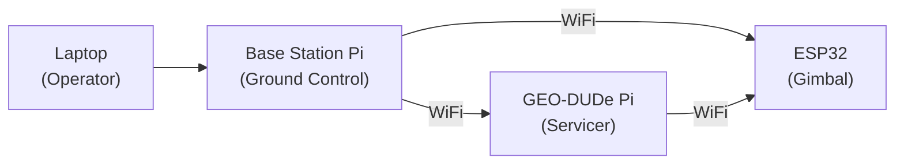

# Base Station

Standalone ground control station. Separate Raspberry Pi powered by its own wall adapter (5V USB). Not wired into either the GEO-DUDe or gimbal power systems.

---

## Hardware

| | |
|---|---|
| **Controller** | Raspberry Pi |
| **Hostname** | `groundstation.local` |
| **Power** | 5V USB wall adapter (independent) |
| **Ethernet** | 192.168.50.2/24 (laptop connection) |
| **WiFi hotspot** | SSID: `groundstation`, password: `Temp1234`, subnet: 192.168.4.0/24 |
| **Software** | Ground control UI |
| **Connected to** | Laptop (Ethernet), ESP32 + GEO-DUDe (WiFi) |

---

## Communication Links

| Link | From | To | Protocol |
|------|------|----|----------|
| Operator interface | Laptop | Base station Pi | Ethernet / USB / WiFi |
| GEO-DUDe control | Base station Pi | GEO-DUDe Pi | WiFi |
| Gimbal control | Base station Pi | ESP32 | WiFi |

The base station Pi acts as the central coordinator. The operator controls the system from a laptop connected to the base station Pi, which relays commands to both the GEO-DUDe servicer (via its onboard Pi) and the gimbal apparatus (via ESP32).



---

## Network Architecture

The base station Pi runs a WiFi hotspot (`groundstation`) that both the ESP32 and GEO-DUDe Pi connect to. The laptop connects to the Pi via Ethernet (192.168.50.0/24 subnet).

IP forwarding and NAT are enabled on the Pi so the laptop can reach WiFi clients:

```bash
sudo sysctl -w net.ipv4.ip_forward=1
sudo nft add table ip nat
sudo nft add chain ip nat postrouting { type nat hook postrouting priority 100 \; }
sudo nft add rule ip nat postrouting oifname wlan0 masquerade
sudo nft add table ip filter
sudo nft add chain ip filter forward { type filter hook forward priority 0 \; policy accept \; }
```

On the laptop, add a route to the WiFi subnet:
```bash
sudo route add -net 192.168.4.0/24 192.168.50.2
```

| Device | IP | Subnet |
|--------|----|--------|
| Base station Pi (eth0) | 192.168.50.2 | 192.168.50.0/24 |
| Base station Pi (wlan0) | 192.168.4.1 | 192.168.4.0/24 |
| ESP32 (gimbal) | 192.168.4.222 | 192.168.4.0/24 |
| Laptop (Ethernet) | 192.168.50.x | 192.168.50.0/24 |

## Notes

- No fusing or power distribution needed - just a Pi with a USB power supply
- WiFi range should be tested with the GEO-DUDe rotating inside the gimbal apparatus
- The GEO-DUDe Pi and ESP32 also communicate directly with each other over WiFi for coordinated operation
- Laptop connects via Ethernet to the Pi (192.168.50.0/24)
