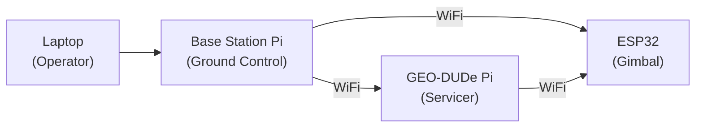

# Base Station

Standalone ground control station. Separate Raspberry Pi powered by its own wall adapter (5V USB). Not wired into either the GEO-DUDe or gimbal power systems.

---

## Hardware

| | |
|---|---|
| **Controller** | Raspberry Pi |
| **Power** | 5V USB wall adapter (independent) |
| **Communication** | WiFi (built-in) |
| **Software** | Ground control UI |
| **Connected to** | Laptop (for operator interface) |

---

## Communication Links

| Link | From | To | Protocol |
|------|------|----|----------|
| Operator interface | Laptop | Base station Pi | Ethernet / USB / WiFi |
| GEO-DUDe control | Base station Pi | GEO-DUDe Pi | WiFi |
| Gimbal control | Base station Pi | ESP32 | WiFi |

The base station Pi acts as the central coordinator. The operator controls the system from a laptop connected to the base station Pi, which relays commands to both the GEO-DUDe servicer (via its onboard Pi) and the gimbal apparatus (via ESP32).

---

## Notes

- No fusing or power distribution needed - just a Pi with a USB power supply
- WiFi range should be tested with the GEO-DUDe rotating inside the gimbal apparatus
- The GEO-DUDe Pi and ESP32 also communicate directly with each other over WiFi for coordinated operation
- Laptop connection method TBD (Ethernet, USB, or WiFi to the Pi)
