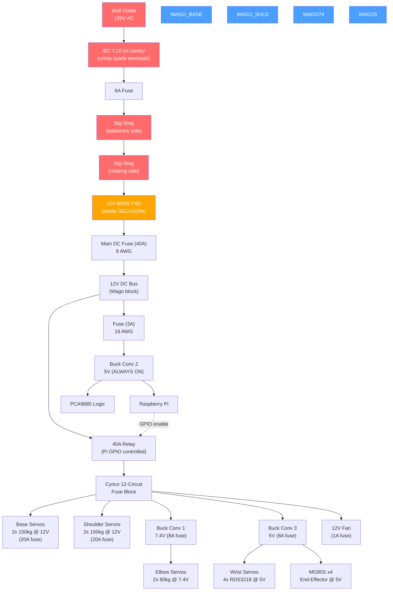
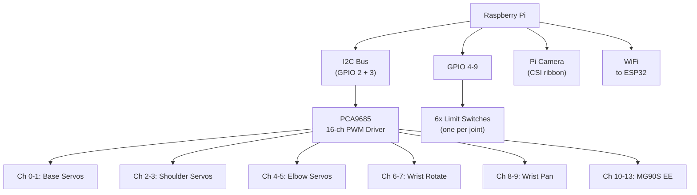

# GEO-DUDe Electronics

The GEO-DUDe servicer subscale model runs on a 12V system. A Raspberry Pi controls all 14 servos via a PCA9685 PWM driver board over I2C. The entire system sits inside the rotating satellite body, powered by 120V AC mains passed through a slip ring.

---

## Controller

| | |
|---|---|
| **Main controller** | Raspberry Pi (already have, Zeul) |
| **PWM driver** | PCA9685 16-channel I2C PWM board (**add to BOM**) |
| **Camera** | Raspberry Pi Camera (AI vision, already have, Zeul) |
| **Comms to ESP32** | WiFi (both have built-in WiFi, no extra hardware) |

The PCA9685 drives all 14 servo signal lines over I2C (2 Pi pins). Limit switches connect directly to Pi GPIO (6 needed, plenty of free pins).

### Pi Connections

| Pi Pin | Goes To | Protocol | Notes |
|--------|---------|----------|-------|
| I2C SDA (GPIO 2) | PCA9685 | I2C | All 14 servo PWM signals |
| I2C SCL (GPIO 3) | PCA9685 | I2C | Shared bus |
| GPIO 4-9 (6 pins) | Limit switches | Digital input | One per joint, pulled up |
| GPIO TBD | Servo power relay | Digital output | HIGH to enable servo power after boot |
| CSI connector | Pi Camera | Ribbon cable | Fixed mount near Pi |
| WiFi | ESP32 | Wireless | Coordinated operation |

---

## Robotic Arm

6-DOF servo-driven arm for approach and capture via the defunct satellite's kick-engine nozzle. **All dumb PWM servos**, no smart servos.

| Joint | Servo | Torque | Qty | Voltage | Stall Current (each) | Source |
|-------|-------|--------|-----|---------|---------------------|--------|
| Base | [HOOYIJ 150kg](https://www.amazon.ca/HOOYIJ-Digital-Waterproof-Stainless-Steering/dp/B0CX92QNJY) | 150 kg-cm | 2 | **12V** | 8.0A | [Datasheet](https://www.amazon.com/HOOYIJ-RDS51150-Steering-U-Shaped-Brackets/dp/B0CP126F77) |
| Shoulder | [ANNIMOS 150kg](https://www.amazon.ca/ANNIMOS-Voltage-Digital-Steering-Brackets/dp/B0C69W2QP7) | 150 kg-cm | 2 | **12V** | 8.0A | |
| Elbow | [ANNIMOS 80kg](https://www.amazon.ca/ANNIMOS-Waterproof-Digital-Steering-Brackets/dp/B0C69WWLWQ) | 80 kg-cm | 2 | **7.4V** | 5.0A | [Specs](https://www.amazon.com/ANNIMOS-Waterproof-Digital-Steering-Brackets/dp/B0C69WWLWQ) |
| Wrist (rotate) | [Wishiot RDS3218](https://www.amazon.ca/Wishiot-RDS3218-Waterproof-Mounting-Bracket/dp/B0CCXRCFK4) | 20 kg-cm | 2 | **5V** | 1.6A | 270 deg, with U-bracket |
| Wrist (pan) | [Wishiot RDS3218](https://www.amazon.ca/Wishiot-RDS3218-Waterproof-Mounting-Bracket/dp/B0CCXRCFK4) | 20 kg-cm | 2 | **5V** | 1.6A | 270 deg, with U-bracket |
| End-effector | [Miuzei MG90S](https://www.amazon.ca/Miuzei-MG90S-Servo-Helicopter-Arduino/dp/B0CP98TZJ2) | 2 kg-cm | 4 | **5V** | ~0.5A | Standard MG90S |

**Total: 14 dumb PWM servos**, all driven by PCA9685 I2C PWM driver.

---

## Power Supply

| | |
|---|---|
| **Voltage** | 12V |
| **Power** | 600W (50A max) |
| **Input** | 120V AC mains via slip ring |
| **Location** | Inside rotating GEO-DUDe body |
| **Output terminals** | Screw terminals to Wago distribution blocks |
| **Link** | [Amazon.ca](https://www.amazon.ca/VAYALT-Switching-Universal-Transformer-Industrial/dp/B0DXL2BCGS) |

---

## Power Distribution (Wago Blocks)

All DC power distribution uses **Wago lever connectors** (from Mach). Each voltage rail gets its own Wago block. The PCA9685 only carries signal wires - servo power is wired directly from the correct voltage rail.

```
12V PSU output (8 AWG trunk)
    │
    ├── Main Fuse (40A) ──→ 12V Bus (Wago)
    │                          │
    │                          ├── Fuse (3A) ──→ Buck conv 2 (5V) ──→ 5V Pi Wago
    │                          │   (ALWAYS ON - taps off BEFORE relay)
    │                          │         ├──→ Raspberry Pi (20 AWG)
    │                          │         └──→ PCA9685 VCC (22 AWG)
    │                          │
    │                          └── RELAY (Pi GPIO controlled, normally open)
    │                                │
    │                                └── Fuse block (12-circuit, Cyrico)
    │                                      ├── 20A: Base servo L + R (14 AWG)
    │                                      ├── 20A: Shoulder servo L + R (14 AWG)
    │                                      ├── 8A: Buck conv 1 (7.4V) ──→ Elbow L + R
    │                                      ├── 8A: Buck conv 3 (5V) ──→ 5V Servo Wago
    │                                      │         ├──→ RDS3218 wrist x4 (18 AWG)
    │                                      │         └──→ MG90S #1-4 (22 AWG)
    │                                      ├── 1A: 12V fan
    │                                      └── (spare circuits)
    │
    └── GND Bus (8 AWG) ──→ Everything (star ground via fuse block negative bus)
```

**Power-on sequence:** Pi and PCA9685 are always powered via buck 2 (before relay, always on). Pi boots (~30s), then sets GPIO pin HIGH to close relay, energizing the fuse block. All servo power (12V direct, 7.4V via buck 1, 5V via buck 3) flows through the relay. PCA9685 outputs are off until Pi sends I2C commands, so servos stay still even after relay closes.

**Base and shoulder servos run directly off 12V** - no buck converter needed. They're rated 10-12.6V and the PSU outputs 12V.

**Grounding: Star topology.** Every component gets its own GND wire back to the GND Wago bus - no daisy-chaining. This prevents high-current servo ground return from raising the Pi/PCA9685 ground reference. The GND bus may need 2-3 ganged Wago blocks to fit all the wires (17+ connections).

---

## Relay (Power-On Sequencing)

| | |
|---|---|
| **Model** | [irhapsody 120A 12V continuous duty](https://www.amazon.ca/irhapsody-Continuous-Automotive-Current-Starter/dp/B07T35K8S2) |
| **Type** | SPST, 4-pin, normally open |
| **Rating** | 120A continuous at 12V |
| **Coil** | 12V, 80 ohm (0.15A / 1.8W) |
| **Purpose** | Prevent servo power until Pi boots and enables via GPIO |

The Pi GPIO (3.3V, ~16mA max) cannot drive the 12V relay coil directly. Use a simple transistor driver circuit:

```
Pi GPIO (TBD) ──→ 1k resistor ──→ Base of NPN transistor (2N2222)
                                    │
                                    Collector ──→ Relay coil (-)
                                    Emitter ──→ GND

Relay coil (+) ──→ 12V (from bus, before relay)
Flyback diode (1N4007) across relay coil (cathode to +12V, anode to collector)
```

Parts needed: 1x 2N2222 NPN transistor, 1x 1k resistor, 1x 1N4007 flyback diode. All common parts, likely already in stock.

---

## Buck Converters

**3 of 4** [20A 300W buck converters](https://www.amazon.ca/XLX-High-Power-Converter-Adjustable-Protection/dp/B081X5YX8V) are needed. 1 spare.

| Buck # | Output V | Feeds | Max Current | Location | Status |
|--------|----------|-------|-------------|----------|--------|
| 1 | **7.4V** | 2x elbow servos (80kg) | 10A stall | After relay (fuse block 8A circuit) | OK |
| 2 | **5V** | Raspberry Pi + PCA9685 | ~2.6A | **Before relay** (always on) | OK |
| 3 | **5V** | 4x RDS3218 wrist + 4x MG90S | ~8.4A stall | After relay (fuse block 8A circuit) | OK |
| 4 | - | Spare | - | - | |

**Buck converter specs:** Input 6-40V, Output 1.25-36V adjustable (potentiometer), 20A max / 15A continuous, 300W, screw terminals, short circuit protection.

---

## Fuses

Fuses from Mach. Sized at 125-150% of expected max draw.

| Fuse | Branch | Max Draw | Rating | Wire Gauge | Notes |
|------|--------|----------|--------|-----------|-------|
| AC inline | Mains hot line before slip ring | ~5A at 120V | **6A slow-blow** | Mains cable | Protects AC path |
| Main DC | 12V bus after PSU | ~40A worst case | **40A** | **8 AWG** | |
| Base servo branch | 2x base 150kg servos | 16A stall | **20A** | **12 AWG** | Fault isolation |
| Shoulder servo branch | 2x shoulder 150kg servos | 16A stall | **20A** | **12 AWG** | Fault isolation |
| Buck 1 input | Elbow servos | ~6.2A at 12V in | **8A** | 16 AWG | Fuse block circuit |
| Buck 2 input | Pi + PCA9685 only | ~1.1A at 12V in | **3A** | 18 AWG | Before relay (always on) |
| Buck 3 input | Wrist + MG90S servos | ~3.5A at 12V in | **8A** | 16 AWG | Fuse block circuit |
| Fan line | 12V fan | 0.15A | **1A** | 22 AWG | Fuse block circuit |

---

## Slip Ring (AC Mains Passthrough)

A [3-wire 15A slip ring](https://www.amazon.ca/Conductive-Current-Collecting-Electric-Connector/dp/B09NBLY16J) passes 120V AC mains from the gantry through the rotation point (thrust bearing) into the GEO-DUDe body. The servicer rotates continuously (360+) on the thrust bearing on the linear rails.

| | |
|---|---|
| **Model** | 3-wire, 15A per wire, 150 RPM |
| **Carries** | 120V AC mains (live, neutral, ground) |
| **Location** | Between gantry/rail base (stationary) and rotating GEO-DUDe body |

### AC Wiring Path

```
Wall outlet
    --> IEC C16 panel socket on gantry (crimp spade terminals, 6.3mm insulated)
    --> 6A slow-blow inline fuse
    --> Wire to slip ring input (stationary side, solder or crimp butt connectors)
    --> Slip ring output (rotating side)
    --> 12V 600W PSU AC input screw terminals (inside GEO-DUDe)
```

!!! danger "AC mains safety"
    - Slip ring rated 15A per wire at 120V - sufficient for 600W PSU (~5A at 120V)
    - All AC connections must use proper **crimp spade terminals** on the IEC C16
    - Ground wire MUST pass through the slip ring
    - AC wiring physically separated from DC wiring inside GEO-DUDe
    - Inline fuse on AC hot line before slip ring (6A slow-blow)
    - Emergency shutdown: pull the mains plug

---

## Limit Switches

[Momentary limit switches](https://www.amazon.ca/MKBKLLJY-Momentary-Terminal-Electronic-Appliance/dp/B0DK693J79) - **6 needed** (one per joint: base, shoulder, elbow, wrist rotate, wrist pan, end-effector). Connected directly to Pi GPIO with internal pull-up resistors. 24 switches in stock (2 packs of 12), 18 spares.

---

## Cooling

| | |
|---|---|
| **Fan** | [12V 80mm fan](https://www.amazon.ca/KingWin-CF-08LB-80mm-Long-Bearing/dp/B002YFSHPY) |
| **Powered from** | 12V bus via fuse (1A) |

---

## Dropped Components

These items from the original BOM are **no longer needed** for GEO-DUDe electronics:

| Item | Reason |
|------|--------|
| ~~Waveshare smart servo driver board~~ | All servos are dumb PWM, using PCA9685 instead |
| ~~Feetech STS3215 smart servos~~ | Replaced with Wishiot RDS3218 20kg PWM servos for wrist |
| ~~PCF8575 I2C GPIO expander~~ | Only 6 limit switches, Pi GPIO handles it directly |
| ~~Buck converter 4~~ | Only 3 needed (7.4V elbow, 5V Pi, 5V servo), 1 spare |

---

## Components To Add to BOM

| Item | Purpose | Status |
|------|---------|--------|
| ~~PCA9685 16-ch PWM driver~~ | ~~Drive all 14 servo signal lines via I2C~~ | Added (row 5, $19.99) |
| ~~120A 12V relay (irhapsody)~~ | ~~Power-on sequencing, Pi GPIO via transistor~~ | Added (row 23, ~$15) |
| ~~GPIO screw terminal breakout HAT~~ | ~~Clean wiring for Pi GPIO connections~~ | Added (row 24, $12.99) |

---

## Power Architecture



## Signal Architecture



---

## Design Notes and Concerns

### Servo Factory Wire Gauge

The HOOYIJ and ANNIMOS 150kg servos ship with thin pre-attached leads (~18-20 AWG) despite their 8A stall current rating. This is acceptable because:

- Factory leads are short (typically 15-30cm)
- Voltage drop over short runs is minimal
- The fuse protects the branch, not the individual servo lead
- Do NOT extend these leads with thin wire. If longer runs are needed, splice with 14 AWG and use proper crimp butt connectors with heat shrink.

### Heat Dissipation

The GEO-DUDe body is a semi-enclosed rotating structure containing:

- 600W PSU (generates heat even at partial load)
- Up to 14 servos (heat from those near the body)
- 3x buck converters
- Relay

Currently only 1x 80mm 12V fan for cooling. Considerations:

- The body is **not fully sealed** - 3D printed PLA structure will have gaps and openings for the arm
- Rotation itself creates some airflow through openings
- Most servos are on the arm (outside the body), not inside
- Buck converters and PSU are the main internal heat sources
- **Monitor temperatures during initial testing.** If thermals are a problem, add a second fan or cut ventilation slots in the body panels.

### WiFi Reliability

The Pi communicates with the ESP32 via WiFi. The rotating GEO-DUDe body may attenuate the signal if it has significant metal structure.

- PLA body is RF-transparent, so if the structure is mostly 3D printed, WiFi should be fine
- Metal fasteners, the PSU housing, and the thrust bearing are localized shielding
- The Pi's onboard WiFi antenna is omnidirectional
- **If signal is weak:** mount a small external antenna or use a USB WiFi adapter positioned near a PLA panel opening
- Test WiFi RSSI during rotation before relying on it for real-time control

### Cable Management (Rotating Body)

All wires inside the GEO-DUDe body experience forces during rotation. At low RPM (subscale test speeds), centrifugal forces are small, but wires still need to be secured:

- **Zip-tie all wire bundles** to the internal frame/structure
- **Strain relief** at every connection point (screw terminals, Wago blocks, servo connectors)
- Use **cable clips or adhesive tie mounts** on the 3D printed structure
- Route wires along structural members, not floating freely
- The arm cable bundle (signal + power to all 14 servos) exits the body through a single opening - use a **grommet or cable gland** to prevent chafing
- Keep slack to a minimum, but leave enough for the arm's range of motion

### Software Current Limiting

No hardware current sensing is implemented. Software-side protections to implement on the Pi:

- **Stall detection:** If a servo command doesn't result in expected motion (via limit switches or timing), cut PWM to that channel via PCA9685
- **Startup sequence:** Enable servos one joint at a time (base first, then shoulder, etc.) rather than all at once, to avoid inrush current spikes
- **Timeout:** If any servo is commanded to a position for more than a few seconds without reaching it, assume stall and disable
- **Temperature monitoring:** Consider adding a cheap I2C temperature sensor (like DS18B20) near the PSU and buck converters to trigger fan speed increase or servo shutdown if overheating
