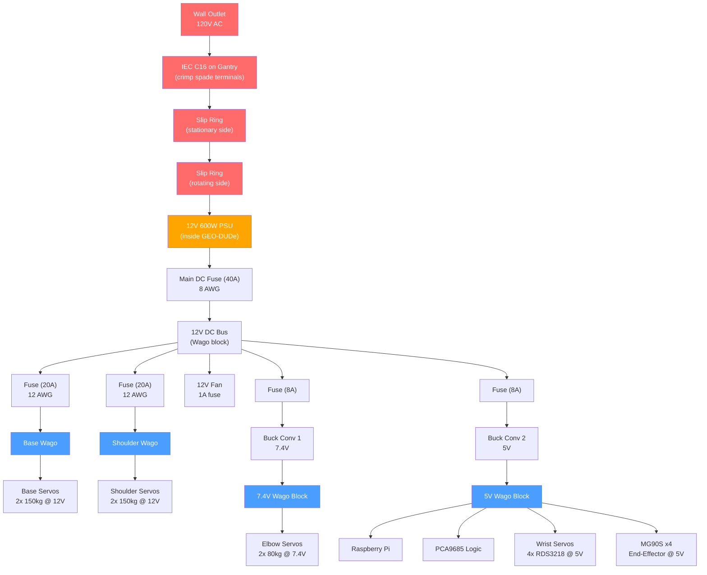
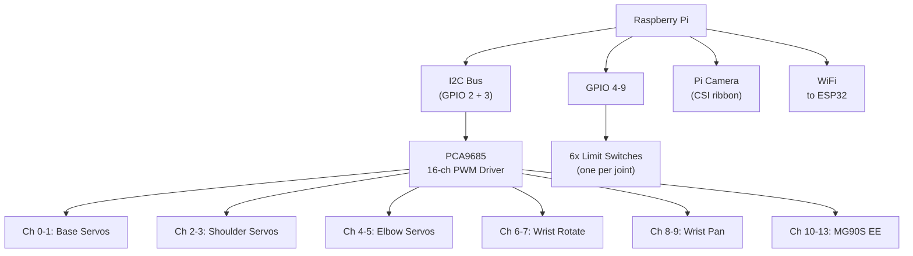

# GEO-DUDe Electronics

The GEO-DUDe servicer subscale model runs on a 12V system. A Raspberry Pi controls all 14 servos via a PCA9685 PWM driver board over I2C. The entire system sits inside the rotating satellite body, powered by 120V AC mains passed through a slip ring.

---

## Controller

| | |
|---|---|
| **Main controller** | Raspberry Pi (already have, Zeul) |
| **PWM driver** | PCA9685 16-channel I2C PWM board (**add to BOM**) |
| **Camera** | Raspberry Pi Camera (AI vision, already have, Zeul) |
| **Comms to ESP32** | WiFi (both have built-in WiFi, no extra hardware) |

The PCA9685 drives all 14 servo signal lines over I2C (2 Pi pins). Limit switches connect directly to Pi GPIO (6 needed, plenty of free pins).

### Pi Connections

| Pi Pin | Goes To | Protocol | Notes |
|--------|---------|----------|-------|
| I2C SDA (GPIO 2) | PCA9685 | I2C | All 14 servo PWM signals |
| I2C SCL (GPIO 3) | PCA9685 | I2C | Shared bus |
| GPIO 4-9 (6 pins) | Limit switches | Digital input | One per joint, pulled up |
| CSI connector | Pi Camera | Ribbon cable | |
| WiFi | ESP32 | Wireless | Coordinated operation |

---

## Robotic Arm

6-DOF servo-driven arm for approach and capture via the defunct satellite's kick-engine nozzle. **All dumb PWM servos**, no smart servos.

| Joint | Servo | Torque | Qty | Voltage | Stall Current (each) | Source |
|-------|-------|--------|-----|---------|---------------------|--------|
| Base | [HOOYIJ 150kg](https://www.amazon.ca/HOOYIJ-Digital-Waterproof-Stainless-Steering/dp/B0CX92QNJY) | 150 kg-cm | 2 | **12V** | 8.0A | [Datasheet](https://www.amazon.com/HOOYIJ-RDS51150-Steering-U-Shaped-Brackets/dp/B0CP126F77) |
| Shoulder | [ANNIMOS 150kg](https://www.amazon.ca/ANNIMOS-Voltage-Digital-Steering-Brackets/dp/B0C69W2QP7) | 150 kg-cm | 2 | **12V** | ~8.0A (confirm) | |
| Elbow | [ANNIMOS 80kg](https://www.amazon.ca/ANNIMOS-Waterproof-Digital-Steering-Brackets/dp/B0C69WWLWQ) | 80 kg-cm | 2 | **7.4V** | 5.0A | [Specs](https://www.amazon.com/ANNIMOS-Waterproof-Digital-Steering-Brackets/dp/B0C69WWLWQ) |
| Wrist (rotate) | [Wishiot RDS3218](https://www.amazon.ca/Wishiot-RDS3218-Waterproof-Mounting-Bracket/dp/B0CCXRCFK4) | 20 kg-cm | 2 | **5V** | 1.6A | 270 deg, with U-bracket |
| Wrist (pan) | [Wishiot RDS3218](https://www.amazon.ca/Wishiot-RDS3218-Waterproof-Mounting-Bracket/dp/B0CCXRCFK4) | 20 kg-cm | 2 | **5V** | 1.6A | 270 deg, with U-bracket |
| End-effector | [Miuzei MG90S](https://www.amazon.ca/Miuzei-MG90S-Servo-Helicopter-Arduino/dp/B0CP98TZJ2) | 2 kg-cm | 4 | **5V** | ~0.5A | Standard MG90S |

**Total: 14 dumb PWM servos**, all driven by PCA9685 I2C PWM driver.

---

## Power Supply

| | |
|---|---|
| **Voltage** | 12V |
| **Power** | 600W (50A max) |
| **Input** | 120V AC mains via slip ring |
| **Location** | Inside rotating GEO-DUDe body |
| **Output terminals** | Screw terminals to Wago distribution blocks |
| **Link** | [Amazon.ca](https://www.amazon.ca/VAYALT-Switching-Universal-Transformer-Industrial/dp/B0DXL2BCGS) |

---

## Power Distribution (Wago Blocks)

All DC power distribution uses **Wago lever connectors** (from Mach). Each voltage rail gets its own Wago block. The PCA9685 only carries signal wires - servo power is wired directly from the correct voltage rail.

```
12V PSU output (8 AWG trunk)
    │
    ├── Main Fuse (40A) ──→ 12V Bus (Wago)
    │                          │
    │                          ├── Fuse (20A) ──→ Base Wago (12 AWG)
    │                          │                    ├──→ Base servo L (14 AWG)
    │                          │                    └──→ Base servo R (14 AWG)
    │                          │
    │                          ├── Fuse (20A) ──→ Shoulder Wago (12 AWG)
    │                          │                    ├──→ Shoulder servo L (14 AWG)
    │                          │                    └──→ Shoulder servo R (14 AWG)
    │                          │
    │                          │
    │                          └──→ 12V Fan (22 AWG, 1A fuse)
    │
    ├── Fuse (8A) ──→ Buck converter 1 (set to 7.4V, 16 AWG)
    │                    └──→ Wago block (7.4V rail)
    │                          ├──→ Elbow servo L (18 AWG)
    │                          └──→ Elbow servo R (18 AWG)
    │
    ├── Fuse (8A) ──→ Buck converter 2 (set to 5V, 16 AWG)
    │                    └──→ Wago block (5V rail)
    │                          ├──→ Raspberry Pi (20 AWG)
    │                          ├──→ PCA9685 VCC (22 AWG)
    │                          ├──→ RDS3218 wrist rotate L (18 AWG)
    │                          ├──→ RDS3218 wrist rotate R (18 AWG)
    │                          ├──→ RDS3218 wrist pan L (18 AWG)
    │                          ├──→ RDS3218 wrist pan R (18 AWG)
    │                          ├──→ MG90S #1-4 (22 AWG each)
    │
    └── GND Bus (8 AWG) ──→ Everything (common ground)
```

**Base and shoulder servos run directly off 12V** - no buck converter needed. They're rated 10-12.6V and the PSU outputs 12V.

---

## Buck Converters

Only **2 of 4** [20A 300W buck converters](https://www.amazon.ca/XLX-High-Power-Converter-Adjustable-Protection/dp/B081X5YX8V) are needed. 2 spares.

| Buck # | Output V | Feeds | Max Current | Status |
|--------|----------|-------|-------------|--------|
| 1 | **7.4V** | 2x elbow servos (80kg) | 10A stall | OK (20A converter) |
| 2 | **5V** | Pi + 4x RDS3218 wrist + 4x MG90S + PCA9685 | ~11A stall | OK (20A converter) |
| 3 | - | Spare | - | |
| 4 | - | Spare | - | |

**Buck converter specs:** Input 6-40V, Output 1.25-36V adjustable (potentiometer), 20A max / 15A continuous, 300W, screw terminals, short circuit protection.

---

## Fuses

Fuses from Mach. Sized at 125-150% of expected max draw.

| Fuse | Branch | Max Draw | Rating | Wire Gauge | Notes |
|------|--------|----------|--------|-----------|-------|
| AC inline | Mains hot line before slip ring | ~5A at 120V | **6A slow-blow** | Mains cable | Protects AC path |
| Main DC | 12V bus after PSU | ~40A worst case | **40A** | **8 AWG** | |
| Base servo branch | 2x base 150kg servos | 16A stall | **20A** | **12 AWG** | Fault isolation |
| Shoulder servo branch | 2x shoulder 150kg servos | 16A stall | **20A** | **12 AWG** | Fault isolation |
| Buck 1 input | Elbow servos | ~6.2A at 12V in | **8A** | 16 AWG | |
| Buck 2 input | Pi + wrist + MG90S | ~5.4A at 12V in | **8A** | 16 AWG | Wrist servos now on 5V rail |
| Fan line | 12V fan | 0.15A | **1A** | 22 AWG | |

---

## Slip Ring (AC Mains Passthrough)

A [3-wire 15A slip ring](https://www.amazon.ca/Conductive-Current-Collecting-Electric-Connector/dp/B09NBLY16J) passes 120V AC mains from the gantry through the rotation point (thrust bearing) into the GEO-DUDe body. The servicer rotates continuously (360+) on the thrust bearing on the linear rails.

| | |
|---|---|
| **Model** | 3-wire, 15A per wire, 150 RPM |
| **Carries** | 120V AC mains (live, neutral, ground) |
| **Location** | Between gantry/rail base (stationary) and rotating GEO-DUDe body |

### AC Wiring Path

```
Wall outlet
    --> IEC C16 panel socket on gantry (crimp spade terminals, 6.3mm insulated)
    --> Wire to slip ring input (stationary side, solder or crimp butt connectors)
    --> Slip ring output (rotating side)
    --> 12V 600W PSU AC input screw terminals (inside GEO-DUDe)
```

!!! danger "AC mains safety"
    - Slip ring rated 15A per wire at 120V - sufficient for 600W PSU (~5A at 120V)
    - All AC connections must use proper **crimp spade terminals** on the IEC C16
    - Ground wire MUST pass through the slip ring
    - AC wiring physically separated from DC wiring inside GEO-DUDe
    - Inline fuse on AC hot line before slip ring (6A slow-blow)

---

## Limit Switches

[Momentary limit switches](https://www.amazon.ca/MKBKLLJY-Momentary-Terminal-Electronic-Appliance/dp/B0DK693J79) - **6 needed** (one per joint: base, shoulder, elbow, wrist rotate, wrist pan, end-effector). Connected directly to Pi GPIO with internal pull-up resistors. 24 switches in stock (2 packs of 12), 18 spares.

---

## Cooling

| | |
|---|---|
| **Fan** | [12V 80mm fan](https://www.amazon.ca/KingWin-CF-08LB-80mm-Long-Bearing/dp/B002YFSHPY) |
| **Powered from** | 12V bus via fuse (1A) |

---

## Dropped Components

These items from the original BOM are **no longer needed** for GEO-DUDe electronics:

| Item | Reason |
|------|--------|
| ~~Waveshare smart servo driver board~~ | All servos are dumb PWM, using PCA9685 instead |
| ~~Feetech STS3215 smart servos~~ | Replaced with Wishiot RDS3218 20kg dumb PWM servos for wrist |
| ~~PCF8575 I2C GPIO expander~~ | Only 6 limit switches, Pi GPIO handles it directly |
| ~~Buck converters 3 and 4~~ | Only 2 needed (7.4V for elbow, 5V for Pi), 2 are spares |

---

## Components To Add to BOM

| Item | Purpose | Est. Cost |
|------|---------|-----------|
| ~~PCA9685 16-ch PWM driver~~ | ~~Drive all 14 servo signal lines via I2C~~ | Added to BOM (row 5, $19.99) |

---

## Power Architecture



## Signal Architecture


