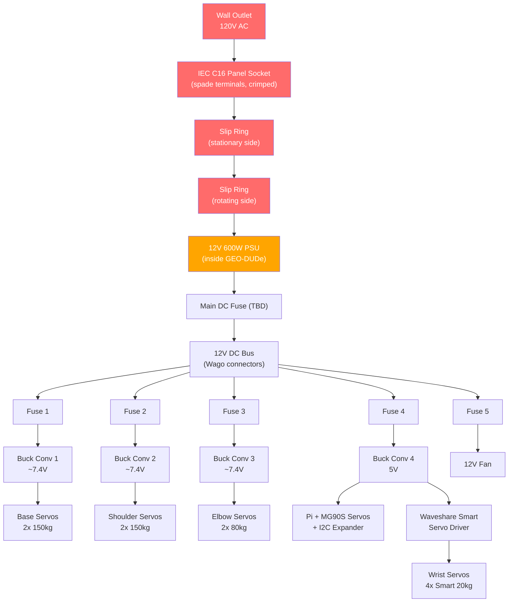
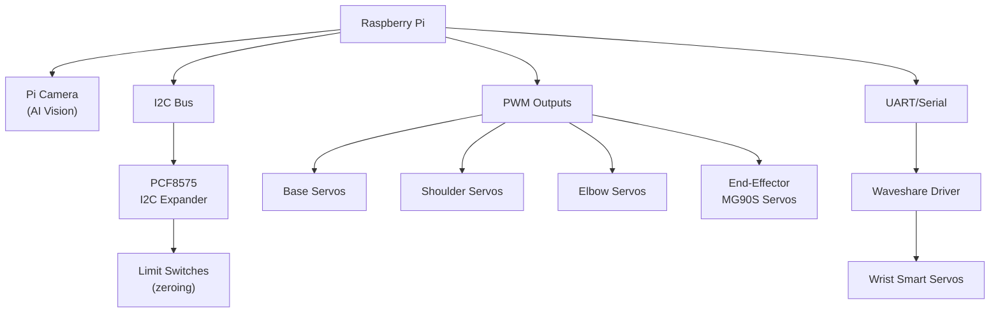

# GEO-DUDe Electronics

The GEO-DUDe servicer subscale model runs on a 12V system with a Raspberry Pi controlling a 6-DOF robotic arm through a mix of PWM, I2C, and serial interfaces.

---

## Controller

| | |
|---|---|
| **Main controller** | Raspberry Pi (already have, Zeul) |
| **Smart servo driver** | [Waveshare servo driver board](https://www.amazon.com/Waveshare-Integrates-Control-Circuit-Supports/dp/B0CTMM4LWK) |
| **I2C expander** | [PCF8575 I2C GPIO expander](https://www.amazon.ca/ACEIRMC-PCF8575-Expander-Extension-Arduino/dp/B09DFWS722) (pack of 3) |
| **Camera** | Raspberry Pi Camera (AI vision, already have, Zeul) |

The Waveshare driver board handles the smart servos (wrist joints) via serial/UART. The I2C expander provides additional GPIO pins for limit switches and standard servo PWM signals.

---

## Robotic Arm

6-DOF servo-driven arm for approach and capture via the defunct satellite's kick-engine nozzle.

| Joint | Servo Type | Torque | Qty | Signal | Notes |
|-------|-----------|--------|-----|--------|-------|
| Base | [HOOYIJ 150kg](https://www.amazon.ca/HOOYIJ-Digital-Waterproof-Stainless-Steering/dp/B0CX92QNJY) | 150 kg-cm | 2 | PWM | Standard hobby servo |
| Shoulder | [ANNIMOS 150kg](https://www.amazon.ca/ANNIMOS-Voltage-Digital-Steering-Brackets/dp/B0C69W2QP7) | 150 kg-cm | 2 | PWM | Robot version with brackets |
| Elbow | [ANNIMOS 80kg](https://www.amazon.ca/ANNIMOS-Waterproof-Digital-Steering-Brackets/dp/B0C69WWLWQ) | 80 kg-cm | 2 | PWM | Robot version with brackets |
| Wrist (rotate) | [RCmall Smart 20kg](https://www.amazon.com/RCmall-Continuous-Programmable-SO-ARM100-Controller/dp/B0F87Z9M3P) | 20 kg-cm | 2 | Serial (UART) | Smart servo, pack of 2 |
| Wrist (pan) | [RCmall Smart 20kg](https://www.amazon.com/RCmall-Continuous-Programmable-SO-ARM100-Controller/dp/B0F87Z9M3P) | 20 kg-cm | 2 | Serial (UART) | Smart servo, pack of 2 |
| End-effector | [Miuzei MG90S](https://www.amazon.ca/Miuzei-MG90S-Servo-Helicopter-Arduino/dp/B0CP98TZJ2) | 2 kg-cm | 4 | PWM | Micro servo, pack of 4 |

**Total: 14 servos** (6 standard PWM + 4 smart serial + 4 micro PWM)

---

## Power Supply

| | |
|---|---|
| **Voltage** | 12V |
| **Power** | 600W (50A) |
| **Input** | Mains via [IEC C16 socket](https://www.amazon.ca/Baomain-Panel-Power-Sockets-Connectors/dp/B00WFZH042) |
| **Link** | [Amazon.ca](https://www.amazon.ca/VAYALT-Switching-Universal-Transformer-Industrial/dp/B0DXL2BCGS) |

---

## Buck Converters

4x [adjustable buck converters](https://www.amazon.ca/XLX-High-Power-Converter-Adjustable-Protection/dp/B081X5YX8V) step 12V down to the voltages needed by each load group.

| Buck # | Output Voltage | Feeds | Notes |
|--------|---------------|-------|-------|
| 1 | ~7.4V (TBD) | Base servos (2x 150kg) | Need servo datasheet to confirm voltage |
| 2 | ~7.4V (TBD) | Shoulder servos (2x 150kg) | Need servo datasheet to confirm voltage |
| 3 | ~7.4V (TBD) | Elbow servos (2x 80kg) | Need servo datasheet to confirm voltage |
| 4 | 5V | Raspberry Pi + micro servos + I2C expander | |

!!! warning "Buck converter current rating check needed"
    Need to verify these buck converters can handle the stall current of the servo groups they feed. The 150kg servos likely draw 4-5A each at stall.

---

## Fuses

Fuses available from Mach. Placement:

| Location | Rating | Protects |
|----------|--------|----------|
| After PSU (main) | TBD | Entire 12V bus |
| Buck converter 1 input | TBD | Base servo branch |
| Buck converter 2 input | TBD | Shoulder servo branch |
| Buck converter 3 input | TBD | Elbow servo branch |
| Buck converter 4 input | TBD | Pi + micro servo branch |
| Fan line | TBD | 12V cooling fan |

!!! note "Fuse sizing blocked on servo datasheets"
    Size each fuse at 125-150% of expected max draw for that branch.

---

## Slip Ring (AC Mains Passthrough)

A [3-wire 15A slip ring](https://www.amazon.ca/Conductive-Current-Collecting-Electric-Connector/dp/B09NBLY16J) passes 120V AC mains through the rotation point between the stationary rail base and the rotating GEO-DUDe body. The PSU sits inside GEO-DUDe, so all DC distribution is internal.

| | |
|---|---|
| **Model** | 3-wire, 15A per wire, 150 RPM |
| **Carries** | 120V AC mains (live, neutral, ground) |
| **Location** | Between stationary rail base and rotating servicer body (thrust bearing) |

| Wire | Carries | Connector |
|------|---------|-----------|
| Wire 1 | AC Live (hot) | Crimp spade terminal to IEC C16 |
| Wire 2 | AC Neutral | Crimp spade terminal to IEC C16 |
| Wire 3 | AC Ground | Crimp spade terminal to IEC C16 |

### AC Wiring Path

```
Wall outlet --> IEC C16 panel socket (spade terminals, crimped)
           --> Slip ring input (stationary side)
           --> Slip ring output (rotating side)
           --> 12V 600W PSU AC input (inside GEO-DUDe)
```

!!! danger "AC mains safety"
    - Slip ring is rated 15A per wire at 120V - sufficient for 600W PSU (~5A at 120V)
    - All AC connections must use proper crimp spade terminals on the IEC C16
    - Ground wire MUST be connected through the slip ring for safety
    - AC wiring should be physically separated from DC wiring inside GEO-DUDe
    - Consider adding an inline fuse on the AC hot line before the slip ring

---

## Limit Switches

[Momentary limit switches](https://www.amazon.ca/MKBKLLJY-Momentary-Terminal-Electronic-Appliance/dp/B0DK693J79) (pack of 12, qty 2 = 24 switches) for zeroing/homing each joint.

---

## Cooling

| | |
|---|---|
| **Fan** | [12V 80mm fan](https://www.amazon.ca/KingWin-CF-08LB-80mm-Long-Bearing/dp/B002YFSHPY) |

---

## Power Architecture



## Signal Architecture


