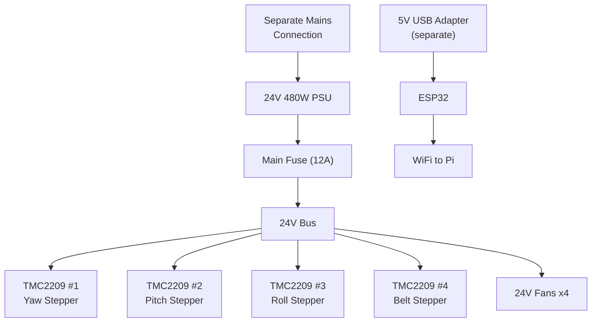

# Gimbal Electronics

The 3-axis gimbal and linear rail system runs on a 24V system with an ESP32 controlling stepper motors through TMC2209 drivers. Separate mains connection from GEO-DUDe.

---

## Controller

| | |
|---|---|
| **MCU** | ESP32 (already have, Aidan M) |
| **Power** | 5V USB adapter (separate from 24V system) |
| **Role** | Gimbal axis control (3 axes) + belt drive motor |
| **Comms to Pi** | WiFi (coordinated operation with GEO-DUDe) |

---

## Stepper Motors and Drivers

4 stepper motors total, driven by TMC2209 stepper drivers.

| Motor | Function | Notes |
|-------|----------|-------|
| Stepper 1 | Gimbal yaw axis | Base rotation on roller bearing |
| Stepper 2 | Gimbal pitch axis | Through 80mm thrust bearing |
| Stepper 3 | Gimbal roll axis | Through 80mm thrust bearing |
| Stepper 4 | Belt drive | Linear approach, housed in gimbal base |

!!! warning "Stepper motor specs unknown"
    Aidan M has the 4 stepper motors but NEMA size and current rating are not documented. The TMC2209 maxes out at ~1.77A RMS with the BTT module's sense resistors. If the motors are NEMA 23 rated above 2A/phase, these drivers will be undersized. **Aidan needs to confirm motor model and current rating.**

### Mounting

All 4 TMC2209 modules are mounted on a **breadboard** inside the gimbal base enclosure. Each driver needs:

- 100uF 50V electrolytic cap across VMOT/GND (as close to driver pins as possible)
- 100nF ceramic cap in parallel (optional but recommended)
- Heatsink installed on IC (included in pack)

### TMC2209 Drivers

| | |
|---|---|
| **Driver IC** | TMC2209 (BIGTREETECH V1.3) |
| **Quantity** | Pack of 5 (4 needed, 1 spare) |
| **VMOT range** | 4.75-28V (24V is ideal) |
| **Current limit** | 2A RMS / 2.8A peak per driver (1.77A effective max with 110 mOhm sense resistors) |
| **Logic voltage (VIO)** | 3.3-5V (ESP32 3.3V is fine) |
| **Features** | StealthChop (silent), SpreadCycle, UART config, sensorless homing (StallGuard4), CoolStep |
| **Heatsinks** | Included in pack, must be installed |
| **Link** | [Amazon.ca](https://www.amazon.ca/BIGTREETECH-TMC2209-Stepper-Stepstick-Heatsink/dp/B0CQC7QMS2) |

### UART Addressing

All 4 TMC2209 drivers can share a single UART bus from the ESP32. Each driver gets a unique address via MS1/MS2 pins:

| Driver | Motor | MS1 | MS2 | Address |
|--------|-------|-----|-----|---------|
| TMC2209 #1 | Yaw | LOW | LOW | 0 |
| TMC2209 #2 | Pitch | HIGH | LOW | 1 |
| TMC2209 #3 | Roll | LOW | HIGH | 2 |
| TMC2209 #4 | Belt | HIGH | HIGH | 3 |

ESP32 TX and RX are bridged with a **1k ohm resistor** for the single-wire UART interface. The TMCStepper Arduino library handles echo stripping automatically.

!!! warning "Critical TMC2209 Requirements"
    - **100uF electrolytic cap on each VMOT** (50V rated) - protects against back-EMF spikes. Without this, drivers will die. Add 100nF ceramic in parallel.
    - **Power sequencing:** VMOT must power up BEFORE VIO, and VIO must power down BEFORE VMOT.
    - **Never disconnect a motor while powered** - the voltage spike destroys the driver instantly.
    - **CLK pin must be tied to GND** (uses internal 12MHz clock). Floating CLK causes erratic behavior.
    - **Never hot-swap drivers** - always power down first.

### Current Setting

In UART mode, motor current is set digitally via IRUN/IHOLD registers (no potentiometer needed). In standalone STEP/DIR mode, adjust the onboard Vref potentiometer:

- Formula: I_RMS = (Vref / 2.5V) x 1.77A
- Factory default Vref ~1.2V = ~0.85A RMS
- For 1.5A RMS motor: set Vref to ~2.12V

### Wiring

| | |
|---|---|
| **Motor cables** | 1M, 6-pin to 4-pin (pack of 4, qty 2 packs) |
| **Link** | [Amazon.ca](https://www.amazon.ca/Stepper-Cables-Printer-XH2-54-Terminal/dp/B0DKJ69DQX) |

### ESP32 Pin Assignments

| Driver | STEP | DIR |
|--------|------|-----|
| TMC2209 #1 (Yaw) | GPIO 13 | GPIO 14 |
| TMC2209 #2 (Pitch) | GPIO 16 | GPIO 17 |
| TMC2209 #3 (Roll) | GPIO 18 | GPIO 19 |
| TMC2209 #4 (Belt) | GPIO 25 | GPIO 26 |

UART bus: ESP32 GPIO TBD (one pin, bridged TX/RX with 1k resistor)

---

## Power Supply

| | |
|---|---|
| **Voltage** | 24V |
| **Power** | 480W (20A) |
| **Input** | Separate mains connection (not through slip ring) |
| **Link** | [Amazon.ca](https://www.amazon.ca/BOSYTRO-Switching-Universal-Transformers-Upgraded/dp/B0F7XCLJVM) |

ESP32 is powered separately via a 5V USB adapter, NOT from the 24V bus.

---

## Linear Rail System

| | |
|---|---|
| **Rails** | HGR15, 1000mm, 2 rails + 4 HGH15CA carriages |
| **Belt** | 5M GT2 timing belt with pulleys and tensioners |
| **Drive** | Stepper #4 in gimbal base drives belt, translates servicer along rails |

---

## Cooling

| | |
|---|---|
| **Fans** | 24V 80mm brushless (pack of 2, qty 2 packs = 4 fans) |
| **Purpose** | Cooling gimbal base enclosure internals |
| **Link** | [Amazon.ca](https://www.amazon.ca/GDSTIME-Brushless-Ventilateur-Computer-Applications/dp/B0F1FHQKZD) |

---

## Power Architecture

