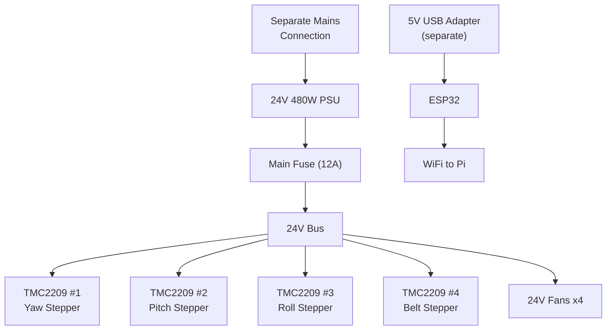

# Gimbal Electronics

The 3-axis gimbal and linear rail system runs on a 24V system with an ESP32 controlling stepper motors through TMC2209 drivers. Separate mains connection from GEO-DUDe.

---

## Controller

| | |
|---|---|
| **MCU** | ESP32 (already have, Aidan M) |
| **Power** | 5V USB adapter (separate from 24V system) |
| **Role** | Gimbal axis control (3 axes) + belt drive motor |
| **Comms to Pi** | WiFi (coordinated operation with GEO-DUDe) |

---

## Stepper Motors and Drivers

4 stepper motors total, driven by TMC2209 stepper drivers.

| Motor | Function | Notes |
|-------|----------|-------|
| Stepper 1 | Gimbal yaw axis | Base rotation on roller bearing |
| Stepper 2 | Gimbal pitch axis | Through 80mm thrust bearing |
| Stepper 3 | Gimbal roll axis | Through 80mm thrust bearing |
| Stepper 4 | Belt drive | Linear approach, housed in gimbal base |

### TMC2209 Drivers

| | |
|---|---|
| **Driver IC** | TMC2209 (BIGTREETECH) |
| **Quantity** | Pack of 5 (4 needed, 1 spare) |
| **Current limit** | 2A RMS per driver |
| **Features** | Silent stepping, UART config, sensorless homing |
| **Link** | [Amazon.ca](https://www.amazon.ca/BIGTREETECH-TMC2209-Stepper-Stepstick-Heatsink/dp/B0CQC7QMS2) |

### Wiring

| | |
|---|---|
| **Motor cables** | 1M, 6-pin to 4-pin (pack of 4, qty 2 packs) |
| **Link** | [Amazon.ca](https://www.amazon.ca/Stepper-Cables-Printer-XH2-54-Terminal/dp/B0DKJ69DQX) |

---

## Power Supply

| | |
|---|---|
| **Voltage** | 24V |
| **Power** | 480W (20A) |
| **Input** | Separate mains connection (not through slip ring) |
| **Link** | [Amazon.ca](https://www.amazon.ca/BOSYTRO-Switching-Universal-Transformers-Upgraded/dp/B0F7XCLJVM) |

ESP32 is powered separately via a 5V USB adapter, NOT from the 24V bus.

---

## Linear Rail System

| | |
|---|---|
| **Rails** | HGR15, 1000mm, 2 rails + 4 HGH15CA carriages |
| **Belt** | 5M GT2 timing belt with pulleys and tensioners |
| **Drive** | Stepper #4 in gimbal base drives belt, translates servicer along rails |

---

## Cooling

| | |
|---|---|
| **Fans** | 24V 80mm brushless (pack of 2, qty 2 packs = 4 fans) |
| **Purpose** | Cooling gimbal base enclosure internals |
| **Link** | [Amazon.ca](https://www.amazon.ca/GDSTIME-Brushless-Ventilateur-Computer-Applications/dp/B0F1FHQKZD) |

---

## Power Architecture

