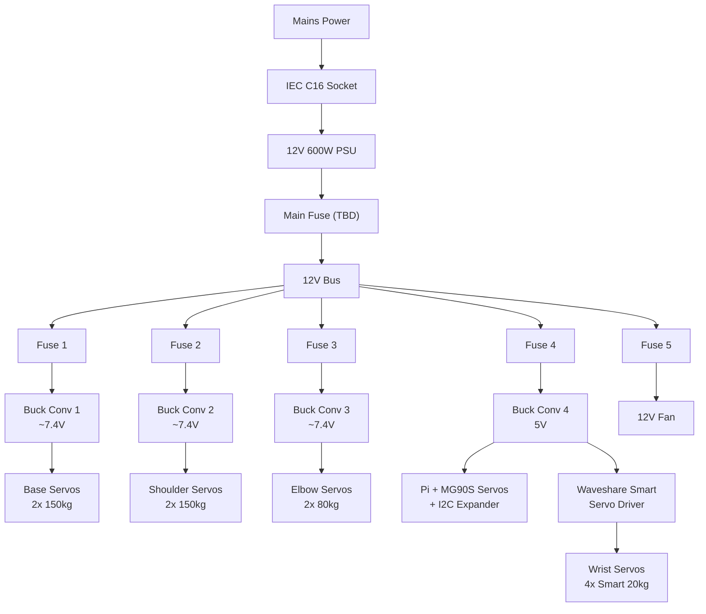
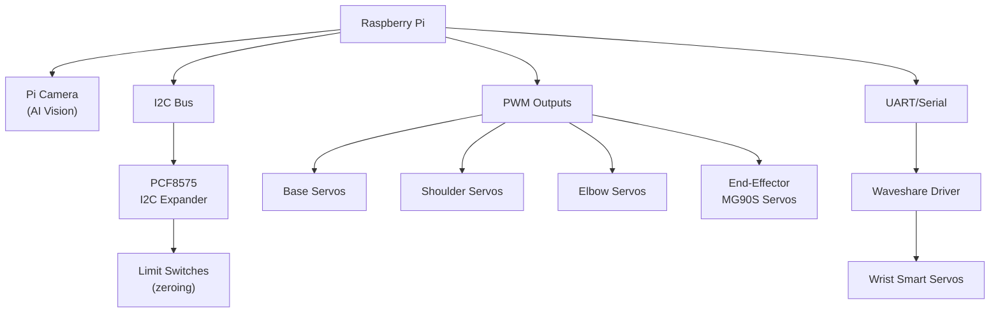

# Subscale Electronics

The subscale satellite has its own independent electrical system. A Raspberry Pi controls the robotic arm servos through a mix of PWM, I2C, and serial interfaces, all powered by a 12V PSU through buck converters.

---

## Controller

| | |
|---|---|
| **Main controller** | Raspberry Pi (already have, Zeul) |
| **Smart servo driver** | [Waveshare servo driver board](https://www.amazon.com/Waveshare-Integrates-Control-Circuit-Supports/dp/B0CTMM4LWK) |
| **I2C expander** | [PCF8575 I2C GPIO expander](https://www.amazon.ca/ACEIRMC-PCF8575-Expander-Extension-Arduino/dp/B09DFWS722) (pack of 3) |

The Waveshare driver board handles the smart servos (wrist joints) via serial/UART. The I2C expander provides additional GPIO pins for limit switches and standard servo PWM signals.

---

## Power Supply

| | |
|---|---|
| **Voltage** | 12V |
| **Power** | 600W (50A) |
| **Input** | Mains via [IEC C16 socket](https://www.amazon.ca/Baomain-Panel-Power-Sockets-Connectors/dp/B00WFZH042) |
| **Link** | [Amazon.ca](https://www.amazon.ca/VAYALT-Switching-Universal-Transformer-Industrial/dp/B0DXL2BCGS) |

---

## Buck Converters

4x [adjustable buck converters](https://www.amazon.ca/XLX-High-Power-Converter-Adjustable-Protection/dp/B081X5YX8V) step 12V down to the voltages needed by each load group.

| Buck # | Output Voltage | Feeds | Notes |
|--------|---------------|-------|-------|
| 1 | ~7.4V (TBD) | Base servos (2x 150kg) | Need servo datasheet to confirm voltage |
| 2 | ~7.4V (TBD) | Shoulder servos (2x 150kg) | Need servo datasheet to confirm voltage |
| 3 | ~7.4V (TBD) | Elbow servos (2x 80kg) | Need servo datasheet to confirm voltage |
| 4 | 5V | Raspberry Pi + micro servos + I2C expander | |

!!! warning "Buck converter current rating check needed"
    Need to verify these buck converters can handle the stall current of the servo groups they feed. The 150kg servos likely draw 4-5A each at stall.

---

## Fuses

Fuses available from Mach (machine shop). Placement plan:

| Location | Rating | Protects |
|----------|--------|----------|
| After PSU (main) | TBD | Entire 12V bus |
| Buck converter 1 input | TBD | Base servo branch |
| Buck converter 2 input | TBD | Shoulder servo branch |
| Buck converter 3 input | TBD | Elbow servo branch |
| Buck converter 4 input | TBD | Pi + micro servo branch |
| Fan line | TBD | 12V cooling fan |

!!! note "Fuse sizing blocked on servo datasheets"
    Size each fuse at 125-150% of the expected max draw for that branch. Need actual stall current specs from servo datasheets.

---

## Wago Connectors

Available from Mach. Used for branch connections off the 12V bus - clean, tool-free wire splicing.

---

## Cooling

| | |
|---|---|
| **Fan** | [12V 80mm fan](https://www.amazon.ca/KingWin-CF-08LB-80mm-Long-Bearing/dp/B002YFSHPY) |
| **Purpose** | Cooling internals of subscale enclosure |

---

## Power Architecture

## Signal Architecture

