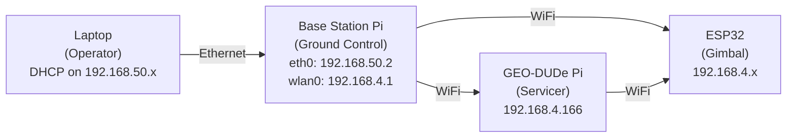

# Base Station

Standalone ground control station. Separate Raspberry Pi powered by its own wall adapter (5V USB). Not wired into either the GEO-DUDe or gimbal power systems.

---

## Hardware

| | |
|---|---|
| **Controller** | Raspberry Pi 4 Model B (8 GB RAM) |
| **Hostname** | `groundstation` |
| **OS** | Debian 13 (Trixie) / Raspberry Pi OS, kernel 6.12, aarch64 |
| **Storage** | 128 GB microSD |
| **Power** | 5V USB wall adapter (independent) |
| **Communication** | Ethernet (to laptop) + WiFi hotspot (to subsystems) |
| **Software** | Ground control UI, reaction wheel web control service |

---

## Network Configuration

### Ethernet (eth0) — Laptop Link

The Pi's built-in Ethernet port connects directly to the operator laptop via a USB Ethernet adapter or small unmanaged switch. The Pi keeps a static IP on `eth0` and runs DHCP for connected laptops, so the laptop side should be left on automatic/DHCP.

| | Pi (`eth0`) | Laptop (USB Ethernet) |
|---|---|---|
| **IP** | `192.168.50.2/24` | `192.168.50.x/24` |
| **Config** | Static (NetworkManager `netplan-eth0`) | DHCP / automatic |

On macOS, the USB adapter may appear under names like **"USB 10/100/1000 LAN"** or a custom renamed service. Leave it on **Using DHCP**. No manual IP assignment is required.

The reliable operator URL is:

```text
http://192.168.50.2/
```

### WiFi Hotspot (wlan0) — Subsystem Link

The Pi runs a WiFi hotspot on `wlan0` at `192.168.4.1/24`. GEO-DUDe Pi and ESP32 connect to this network.

| | |
|---|---|
| **Interface** | `wlan0` |
| **IP** | `192.168.4.1/24` |
| **SSID** | `groundstation` |
| **Security** | WPA2-PSK (`Temp1234`) |
| **Mode** | Hotspot (access point) |
| **Clients** | GEO-DUDe Pi (`192.168.4.166`), ESP32 |
| **Bandwidth** | ~3 Mbps (measured) |

---

## SSH Access

```bash
ssh zeul@192.168.50.2
```

| | |
|---|---|
| **User** | `zeul` |
| **Password** | `Temp1234` |
| **Auth methods** | publickey, keyboard-interactive |

!!! warning
    Default credentials — change the password before any public demo or field test.

---

## Communication Links

| Link | From | To | Protocol |
|------|------|----|----------|
| Operator interface | Laptop | Base station Pi | Ethernet (`192.168.50.x`) |
| GEO-DUDe control | Base station Pi | GEO-DUDe Pi | WiFi (`192.168.4.x`) |
| Gimbal control | Base station Pi | ESP32 | WiFi (`192.168.4.x`) |

The base station Pi acts as the central coordinator. The operator controls the system from a laptop connected to the base station Pi over Ethernet, which relays commands to both the GEO-DUDe servicer (via its onboard Pi) and the gimbal apparatus (via ESP32) over WiFi.



---

## Network Architecture

The base station Pi runs a WiFi hotspot (`groundstation`) that both the ESP32 and GEO-DUDe Pi connect to. The laptop connects to the Pi via Ethernet (192.168.50.0/24 subnet).

IP forwarding and NAT are enabled on the Pi so the laptop can reach WiFi clients:

```bash
sudo sysctl -w net.ipv4.ip_forward=1
sudo nft add table ip nat
sudo nft add chain ip nat postrouting { type nat hook postrouting priority 100 \; }
sudo nft add rule ip nat postrouting oifname wlan0 masquerade
sudo nft add table ip filter
sudo nft add chain ip filter forward { type filter hook forward priority 0 \; policy accept \; }
```

On the laptop, add a route to the WiFi subnet:
```bash
sudo route add -net 192.168.4.0/24 192.168.50.2
```

| Device | IP | Subnet |
|--------|----|--------|
| Base station Pi (eth0) | 192.168.50.2 | 192.168.50.0/24 |
| Base station Pi (wlan0) | 192.168.4.1 | 192.168.4.0/24 |
| ESP32 (gimbal) | 192.168.4.222 | 192.168.4.0/24 |
| Laptop (Ethernet) | 192.168.50.x | 192.168.50.0/24 |

## Notes

- No fusing or power distribution needed — just a Pi with a USB power supply
- WiFi range should be tested with the GEO-DUDe rotating inside the gimbal apparatus
- The GEO-DUDe Pi and ESP32 also communicate directly with each other over WiFi for coordinated operation
- Laptop connects via Ethernet to the Pi (192.168.50.0/24)

---

## Software

### GEO-DUDe Control Web UI (`wheel-control.service`)

Flask web app exposed to operators at **`http://192.168.50.2/`**. Internally the service still runs on port `8080`, with port `80` redirected to it on the groundstation Pi. Controls GEO-DUDe hardware via HTTP to `192.168.4.166:5000`. Source: [zeulewan/geodude-control](https://github.com/zeulewan/geodude-control) (private).

**Camera:**

- Live MJPEG preview from RPi Camera Module 3 (IMX708)
- 640x480 @ 10fps, JPEG quality 50 (bandwidth-limited by WiFi)
- 180° flipped, proxied through groundstation

**System Stats:**

- CPU%, temperature, load average for both Pis
- Polled at 0.5Hz

**MACE (Reaction Wheel) panel:**

- Hold-to-spin with configurable power and server-side ramp rate (0.1-100 %/s)
- **Bidirectional ESC** — center-stick control (1500us=stop, forward/reverse proportional)
- Ramp progress bar showing target vs current throttle
- No arming sequence needed (plug and play ESC)
- RPM display from encoder (computed server-side at 30Hz, 10-sample rolling average)
- RPM saturation limit at 600 RPM with hysteresis (coast at 600, resume at 420)
- 3-second watchdog — auto-stops motor if browser disconnects

**Attitude Control panel:**

- Closed-loop PID controller for body angle (runs on GEO-DUDe at 100Hz)
- Gyro gz integration for body angle estimation with bias calibration
- Angle dial (body angle + setpoint), revolution counter
- Nudge buttons (+10°, -10°, +90°, -90°) and direct setpoint input
- Live-adjustable PID gains (Kp, Ki, Kd) and max throttle ceiling
- Wheel saturation detection (600 RPM max, auto-coast when saturated)
- Rate-limited output (40.5%/s max)
- Deadband-skip mapping (PID output → bidirectional motor range, skipping ±50-75us center deadband)
- 5-second watchdog auto-disable
- Mutual exclusion with manual MACE control

**PCA9685 Channels panel:**

- Individual sliders for all servo channels (500-2500us for B/W/E/S, center 1500us)
- Servos always active at center on page load (continuous signal required)
- Per-channel center button, ALL CENTER button
- Slider thumb-drag only (no track click-jump), center button ramps slowly

**Sensor readout:**

- Live gyroscope, accelerometer, and encoder angle from GEO-DUDe IMU/encoder
- GEO-DUDe connection status and motor error reporting

### Sensor Server (`sensor-server.service` on GEO-DUDe)

Flask API on GEO-DUDe (`192.168.4.166:5000`). Controls PCA9685 over I2C and reads IMU/encoder.

- `GET /sensors` — gyro, accel, encoder angle, RPM (30Hz I2C polling)
- `GET /system` — CPU%, temperature, load average
- `POST /motor` — MACE ESC control (pulse width in us, 1500=stop, >1500=forward, <1500=reverse, blocked when attitude controller active)
- `POST /pwm` — per-channel PCA9685 control (`{"channel": "B1", "pw": 1500}`)
- `POST /pwm/off` — all channels off
- `GET /channels` — channel mapping
- `GET /camera` — MJPEG stream from RPi Camera Module 3

### Attitude Controller (`attitude-controller.service` on GEO-DUDe)

Separate Flask API on GEO-DUDe (`192.168.4.166:5001`). PID control loop for body angle.

- `GET /status` — full controller state (body angle, setpoint, error, output, gains, RPM, saturation)
- `POST /enable` — calibrate gyro (2s), arm ESC (3s), start PID
- `POST /disable` — stop PID, coast motor
- `POST /setpoint` — set target body angle
- `POST /nudge` — adjust setpoint by delta
- `POST /zero` — reset body angle and setpoint to 0
- `POST /gains` — adjust PID gains live
- `POST /calibrate` — re-run gyro bias calibration
- `POST /stop` — emergency disable

### Networking Notes

- Offline local network — no internet
- Ethernet clients get `192.168.50.x` addresses automatically by DHCP from the groundstation Pi
- Use `http://192.168.50.2/` for the UI; do not rely on hostname discovery for demos or field use
- WiFi bandwidth ~3 Mbps — camera stream and sensor polling are bandwidth-conscious
- GEO-DUDe SSID configured as `groundstation` (no space) in NetworkManager
